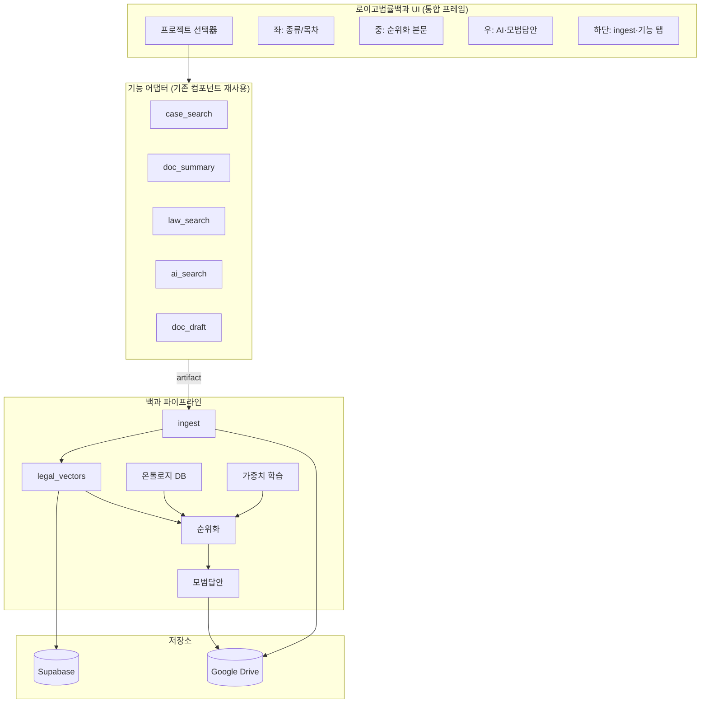

# 로이고법률백과 통합 송무엔진 기획안

> **버전:** v1.0 · 2026-06-14  
> **목표:** AI 문서엔진 6개 기능을 「로이고법률백과」 중심의 **온라인 법률백과 + 프로젝트 단위 송무 워크스페이스**로 통합  
> **프로젝트 키:** `(의뢰인명 + 사건명)` — 기존 `cases` · `clients` · Google Drive와 1:1 연동

---

## 1. 현황 분석 (As-Is)

### 1.1 AI 문서엔진 메뉴 구조

| ID | 메뉴명 | 구현 파일 | API·연동 | 백과 연계 가능 산출물 |
|----|--------|-----------|----------|----------------------|
| `legal_encyclopedia` | 로이고법률백과 | `LegalEncyclopediaWorkspace.tsx` | `/api/ai/legal-encyclopedia` · Supabase `legal_*` | 온톨로지·벡터·순위·모범답안 |
| `case_search` | 판례 자동 추천 | `CaseRecommendTab.tsx` | `/api/ai/gemini` · `/api/precedent` | `PrecedentCard[]` (사건번호·쟁점·본문) |
| `doc_summary` | 판결문 PDF·이미지 요약 | `PdfSummaryTab.tsx` | `/api/document/ocr` · Gemini | 구조화 요약 5섹션 + OCR 원문 |
| `doc_draft` | 법률문서 자동작성 | `BriefDraftTab.tsx` | `/api/ai/gemini` | 서면 초안 (법조문 하이라이트) |
| `law_search` | 법률검색 | `LawSearchTab.tsx` | `/api/ai/gemini` · `/api/law/article` | `LawArticleItem[]` (조문·요약) |
| `ai_search` | AI 검색 | `[featureId]/page.tsx` (generic) | `/api/ai/gemini` | 자연어 통합 답변 |

### 1.2 현재 한계

1. **기능 분리:** 6개 메뉴가 독립 UI·독립 저장(localStorage `lawygo_ai_docs`) — 프로젝트·사건 맥락 없음  
2. **백과 ingest 단독:** `legal_vectors` ingest는 텍스트 붙여넣기만 — PDF/OCR·판례·조문 파이프 미연결  
3. **Drive 미연동:** AI 산출물이 Google Drive `cases/{caseId}/files`에 자동 적재되지 않음  
4. **사건 연동 약함:** `boardId`/`postId` 쿼리만 — `cases`·`clients` FK 없음  
5. **학습 범위:** `legal_feature_weights`가 키워드 단위 — **프로젝트(의뢰인+사건) 단위** 학습 없음  

### 1.3 재사용 가능 인프라

- **Google Drive:** `googleDriveClient.ts` — `cases/{caseId}/files` 업로드 패턴 (`/api/case-files/upload`)  
- **법령 Open API:** `/api/law/article` — law.go.kr 조문 원문  
- **판례 API:** `/api/precedent` — 사건번호 본문  
- **OCR:** `/api/document/ocr` — PDF·이미지 → 텍스트  
- **테넌트:** `management_number` + `resolveManagementNumber`  
- **백과 DB:** `legal_ontology_entries`, `legal_vectors`, `legal_usage_records`, `legal_feature_weights`  

---

## 2. 비전 (To-Be): 「송무 프로젝트 백과」

### 2.1 한 줄 정의

> **의뢰인명 + 사건명**을 프로젝트 ID로, 6개 AI 기능의 모든 산출물을 **온톨로지→벡터→순위→모범답안** 파이프라인에 흡수하고, **Google Drive + Supabase**에 이중 저장하는 **사건 중심 온라인 법률백과**.

### 2.2 사용자 여정

```
① 프로젝트 선택/생성 (의뢰인 ○○ / 사건 △△)
    ↓
② 자료 수집 — PDF 업로드 · 판례추천 · 법령검색 · AI검색
    ↓ (각 기능 → ingest 어댑터 → legal_vectors)
③ 백과 검색 — 키워드·쟁점 기준 순위화·소목차
    ↓
④ 모범답안·서면 초안 — 순위 문서 + 학습 가중치 반영
    ↓
⑤ Drive 저장 + 타임라인 기록 — cases/{id}/encyclopedia/
```

---

## 3. 프로젝트 단위 작업 구조 (핵심 설계)

### 3.1 프로젝트 식별자

```
project_key = slugify(client_name) + "__" + slugify(case_title)
project_id  = cases.id (UUID, 기존 사건 테이블 FK)
display     = "{의뢰인명} · {사건명}"
```

- **신규 사건 없이** 백과만 쓰는 경우 → `encyclopedia_projects` 테이블에 standalone 프로젝트 생성 (optional `case_id` nullable)  
- **기존 사건 연동** → `cases` + `clients` JOIN으로 의뢰인명 자동 표시  

### 3.2 Google Drive 폴더 트리 (권장)

```
LawyGo/                              ← Drive 루트 (설정값)
└── {management_number}/             ← 회사(테넌트)
    └── projects/
        └── {clientName}_{caseTitle}/   ← 프로젝트 루트
            ├── 01_원본자료/            ← PDF·이미지·스캔 (doc_summary 입력)
            ├── 02_판례/                ← case_search JSON·PDF
            ├── 03_법령조문/            ← law_search 추출 조문
            ├── 04_백과_벡터/           ← ingest 메타·export JSON
            ├── 05_모범답안/            ← encyclopedia model_answer
            ├── 06_서면초안/            ← doc_draft 산출물
            └── 07_작업로그/            ← usage_records 스냅샷
```

**기존 호환:** `cases/{caseId}/files` 하위에 `encyclopedia/` 서브폴더를 두어 **기존 사건 자료실 UI와 공존**.

### 3.3 Supabase 스키마 확장 (제안)

```sql
-- 프로젝트 (사건 연동 또는 독립)
CREATE TABLE encyclopedia_projects (
  id uuid PRIMARY KEY DEFAULT gen_random_uuid(),
  management_number text NOT NULL,
  case_id uuid REFERENCES cases(id) ON DELETE SET NULL,
  client_name text NOT NULL,
  case_title text NOT NULL,
  project_key text NOT NULL,
  drive_folder_id text,           -- Google Drive folder ID
  drive_folder_path text,
  status text DEFAULT 'active',   -- active | archived | closed
  created_by text,
  created_at timestamptz DEFAULT now(),
  UNIQUE (management_number, project_key)
);

-- 기능별 산출물 → 백과 ingest 추적
CREATE TABLE encyclopedia_artifacts (
  id uuid PRIMARY KEY DEFAULT gen_random_uuid(),
  project_id uuid REFERENCES encyclopedia_projects(id) ON DELETE CASCADE,
  source_feature text NOT NULL,   -- case_search | doc_summary | ...
  title text NOT NULL,
  content_text text,
  structured_json jsonb,          -- PrecedentCard, LawArticleItem 등
  drive_file_id text,
  legal_vector_ids uuid[],        -- ingest된 vector FK 배열
  legal_document_id uuid REFERENCES legal_documents(id),
  created_at timestamptz DEFAULT now()
);

-- legal_vectors, legal_documents, legal_usage_records 에 project_id 컬럼 추가
ALTER TABLE legal_vectors ADD COLUMN project_id uuid REFERENCES encyclopedia_projects(id);
ALTER TABLE legal_documents ADD COLUMN project_id uuid REFERENCES encyclopedia_projects(id);
ALTER TABLE legal_usage_records ADD COLUMN project_id uuid REFERENCES encyclopedia_projects(id);
ALTER TABLE legal_feature_weights ADD COLUMN project_id uuid REFERENCES encyclopedia_projects(id);
```

---

## 4. 기능별 백과 통합 설계

### 4.1 통합 아키텍처



### 4.2 기능 → ingest 어댑터 매핑

| 기능 | 입력 | 어댑터 함수 (신규) | ingest category | 온톨로지 키워드 소스 |
|------|------|-------------------|-----------------|---------------------|
| **판례 추천** | `PrecedentCard[]` | `precedentCardsToVectors()` | 판례 | 쟁점·사건번호 |
| **PDF 요약** | OCR 텍스트 + 5섹션 | `summarySectionsToVectors()` | 관련법률문서 | 주요 쟁점 키워드 |
| **법률검색** | `LawArticleItem[]` | `lawArticlesToVectors()` | 법령 | 법령명·조문 |
| **AI 검색** | 자연어 답변 | `aiAnswerToVectors()` | 기타자료 | 사용자 질의 |
| **서면 초안** | BriefDraft HTML/text | `draftToVectors()` (역방향: 백과→초안) | 서식 | 첨부 법조문 |
| **백과 검색** | 키워드 | 기존 `ingest` + `search` | — | DB 온톨로지 |

**구현 원칙:** 기존 `CaseRecommendTab`, `PdfSummaryTab` 등 UI는 **그대로** 두고, 공통 훅 `useEncyclopediaIngest(projectId)` + 「백과에 저장」버튼으로 연결.

### 4.3 Cross-Feature 데이터 흐름 예시

**시나리오: 채권자취소권 사건**

1. 프로젝트 `김○○ · 채권자취소권` 선택  
2. **판례 추천** → 5건 카드 → 「백과 저장」→ `legal_vectors` 5건 + Drive `02_판례/`  
3. **PDF 요약** → 판결문 업로드 → OCR → 「백과 저장」→ 조문 단위 벡터  
4. **법률검색** → 민법 406조 → Open API 원문 + ingest  
5. **백과 검색** `채권자취소권` → AI + DB벡터 15건 병합 순위  
6. 소목차 선택 → **모범답안** → Drive `05_모범답안/`  
7. **서면 초안** — 모범답안·순위 1~3위 문서를 `BriefDraftTab` context로 주입  

---

## 5. API 설계 (확장)

### 5.1 신규 엔드포인트

| Method | Path | 설명 |
|--------|------|------|
| GET/POST | `/api/encyclopedia/projects` | 프로젝트 CRUD·목록 (의뢰인+사건) |
| GET | `/api/encyclopedia/projects/[id]` | 프로젝트 상세·통계·artifacts |
| POST | `/api/encyclopedia/projects/[id]/artifacts` | 기능 산출물 → ingest + Drive |
| POST | `/api/encyclopedia/projects/[id]/sync-drive` | Drive 폴더 생성·동기화 |
| POST | `/api/ai/legal-encyclopedia` | **기존 확장:** `projectId` 필수화, `action: sync_from_feature` |

### 5.2 `sync_from_feature` action (신규)

```json
{
  "action": "sync_from_feature",
  "projectId": "uuid",
  "featureId": "case_search",
  "payload": { "cards": [/* PrecedentCard[] */] },
  "saveToDrive": true
}
```

응답: `{ vectorCount, artifactId, driveFileId, drivePath }`

### 5.3 Drive 연동 API 확장

`/api/drive/upload` ALLOWED_PATHS 확장:

```regex
^cases/[^/]+/encyclopedia/.*$
^projects/[^/]+/.*$
```

---

## 6. UI/UX 설계 (로이고법률백과 통합 프레임)

### 6.1 레이아웃 (특허 다면적 프레임 + 프로젝트 컨텍스트)

```
┌─────────────────────────────────────────────────────────────────┐
│ [프로젝트: 김○○ · 채권자취소권 ▼]  [Drive 열기]  [검색 키워드___] │
├──────────┬──────────────────────────────┬───────────────────────┤
│ 종류     │ 본문 (순위화)                 │ AI · 모범답안          │
│ · 판례   │                              │ · 자질값/벡터          │
│ · 법령   │                              │ · 학습 가중치          │
│ · 서식   │                              │                       │
│ · 업로드 │                              │                       │
├──────────┴──────────────────────────────┴───────────────────────┤
│ [기능 탭] 판례추천 | PDF요약 | 법령검색 | AI검색 | 서면작성 | ingest │
│ (선택 탭 = embedded 기존 Tab 컴포넌트, compact 모드)              │
└─────────────────────────────────────────────────────────────────┘
```

### 6.2 프로젝트 선택器

- **1순위:** `cases` 목록 (의뢰인명 JOIN)  
- **2순위:** 「새 백과 프로젝트」— 의뢰인명·사건명 수동 입력  
- **3순위:** 최근 사용 5건  

선택 시 `localStorage` + URL `?projectId=` 동기화.

### 6.3 각 기능 탭 (Embedded Mode)

기존 Tab 컴포넌트에 props 추가:

```typescript
interface EncyclopediaEmbedProps {
  projectId: string;
  compact?: boolean;
  onArtifactReady: (artifact: EncyclopediaArtifactInput) => void;
  initialContext?: RankedLegalDocument[];  // 백과 → 서면 초안
}
```

---

## 7. 학습·반복해결 확장

### 7.1 학습 단위 3계층

| 계층 | 키 | 용도 |
|------|-----|------|
| 전역 | `keyword` | 온톨로지·공통 법률어 |
| 프로젝트 | `project_id + keyword` | 사건별 쟁점 가중치 |
| 사용자 | `login_id + project_id + feature_label` | 개인 선택 패턴 |

### 7.2 반복해결 매커니즘 (특허 도5) 프로젝트 적용

- 동일 프로젝트에서 동일 소목차 2회 선택 → `repetitiveResolution: true`  
- 프로젝트 종료 시 `legal_feature_weights`를 **템플릿**으로 export → 유사 사건 신규 프로젝트에 seed  

---

## 8. 구현 로드맵 (4 Phase)

### Phase 1 — 프로젝트 골격 (2주)

- [ ] `encyclopedia_projects` · `encyclopedia_artifacts` 마이그레이션  
- [ ] `/api/encyclopedia/projects` CRUD  
- [ ] `LegalEncyclopediaWorkspace` 상단 프로젝트 선택器  
- [ ] Drive 폴더 자동 생성 (`sync-drive`)  
- [ ] `legal_*` 테이블 `project_id` 컬럼 + 기존 ingest/search 필터  

### Phase 2 — 기능 ingest 연동 (2~3주)

- [ ] `src/lib/legalEncyclopedia/adapters/` — 5개 feature → vector 변환  
- [ ] `sync_from_feature` API  
- [ ] 각 Tab에 「백과에 저장」버튼 + `onArtifactReady`  
- [ ] Drive 자동 업로드 (JSON + 요약 txt)  

### Phase 3 — 통합 UI (2주)

- [ ] 하단 기능 탭 embedded 모드  
- [ ] 백과 검색 결과 → BriefDraft context 주입  
- [ ] 프로젝트별 usage·weights  
- [ ] 사건 타임라인 연동 (`timeline` 테이블 이벤트)  

### Phase 4 — 고도화 (지속)

- [ ] law.go.kr · precedent API 결과 **자동 ingest** (AI 없이)  
- [ ] 프로젝트 간 벡터 유사도 (유사 사건 추천)  
- [ ] 모범답안·서면 Word/PDF export → Drive  
- [ ] RLS·감사로그 (`case_audit_logs` 패턴)  

---

## 9. 파일·모듈 구조 (권장)

```
src/lib/legalEncyclopedia/
├── adapters/
│   ├── precedentAdapter.ts      ← CaseRecommendTab 산출물
│   ├── pdfSummaryAdapter.ts     ← PdfSummaryTab
│   ├── lawSearchAdapter.ts      ← LawSearchTab
│   ├── aiSearchAdapter.ts
│   └── briefDraftAdapter.ts
├── project/
│   ├── encyclopediaProjectDb.ts
│   ├── driveProjectFolders.ts   ← googleDriveClient 래퍼
│   └── projectContext.ts
├── ingest.ts                    (기존)
├── legalEncyclopediaDb.ts       (기존, project_id 확장)
└── ...

src/components/board/ai/
├── LegalEncyclopediaWorkspace.tsx  ← 통합 허브 (확장)
├── encyclopedia/
│   ├── ProjectSelector.tsx
│   ├── FeatureDock.tsx             ← 하단 5탭 embedded
│   └── ArtifactSaveButton.tsx
├── CaseRecommendTab.tsx            (props 확장만)
├── PdfSummaryTab.tsx
└── ...
```

---

## 10. 성공 지표 (KPI)

| 지표 | 목표 |
|------|------|
| 프로젝트 생성 → 첫 ingest | < 3분 |
| 기능 산출물 → 백과 검색 반영 | 실시간 (< 5초) |
| Drive 저장 성공률 | > 95% |
| 동일 프로젝트 재검색 순위 개선 | 2회 선택 후 top-3 변동 |
| 사건 자료실 ↔ 백과 파일 일치 | 100% (case_id 연동 시) |

---

## 11. 리스크·대응

| 리스크 | 대응 |
|--------|------|
| Drive 미설정 | Supabase only + local fallback (기존 case-files 패턴) |
| AI hallucination | 법조문·판례는 Open API 원문 ingest 우선, AI는 보조 |
| 대용량 PDF | OCR 청크 → clause 단위 ingest (기존 `extractLegalClauses`) |
| 테넌트 격리 | 모든 쿼리 `management_number` + `project_id` 이중 필터 |
| localStorage 의존 | Phase 1부터 artifacts DB 저장, localStorage 제거 |

---

## 12. 즉시 착수 가능한 Quick Win (1주)

1. `LegalEncyclopediaWorkspace`에 **사건 선택 드롭다운** (`/api/cases` 연동)  
2. ingest 시 `caseId` → Drive `cases/{id}/encyclopedia/` 업로드  
3. `PdfSummaryTab` 요약 완료 → 「백과 ingest」버튼 1개  
4. `CaseRecommendTab` 결과 → 「백과 ingest」버튼 1개  

---

*본 기획안은 LawyGo 코드베이스(`boardConfig`, AI Tab 컴포넌트, `legalEncyclopedia/*`, `googleDriveClient`) 분석을 바탕으로 작성되었습니다.*
