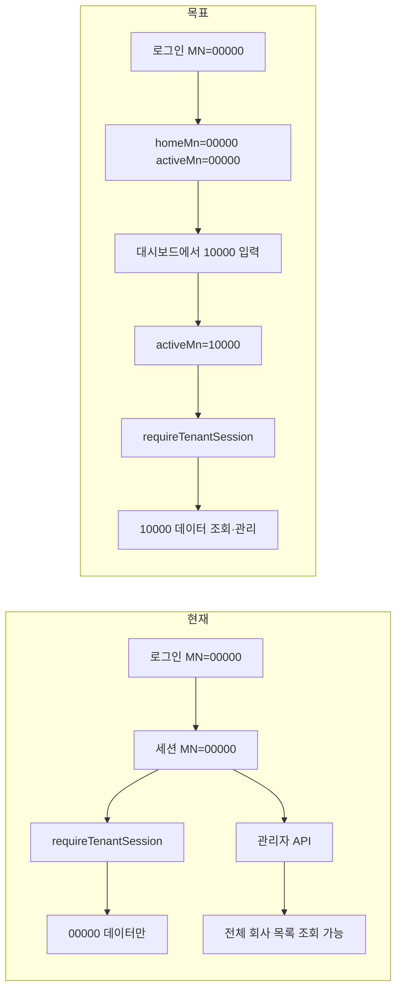

# 전체관리자(shinkang) 관리번호 전환 기능 설계

## 1. 목표

| 항목 | 내용 |
|------|------|
| 계정 | `shinkang` — **전체관리자** (`platform_admin`) |
| 홈 관리번호 | `00000` (로그인·기본 작업 공간) |
| 위임 관리번호 | `10000` (대시보드에서 전환 후 관리) |
| 핵심 UX | 일반 로그인은 00000 기준, 로그인 후 관리 대시보드에서 다른 관리번호를 입력·전환하여 해당 회사를 전체관리자 권한으로 운영 |

## 2. 현재 상태 (갭 분석)

### 이미 구현됨

- `platform_admin` 역할·권한 계층 (`src/lib/adminRoles.ts`)
- 전체관리자 판별: `permission_role_id === platform_admin` 또는 `PLATFORM_ADMIN_LOGIN_IDS` / `PLATFORM_ADMIN_MANAGEMENT_NUMBERS` 환경 변수
- **관리자 API** 일부는 플랫폼 스태프에게 전체 회사 목록 노출 (`/api/admin/company-registry`)
- 구독 게이트 우회: `isAnyPlatformStaff` → 모든 관리번호 접근 허용

### 미구현 (이번 설계 대상)

- 세션의 **활성 관리번호(active tenant)** 와 **소속 관리번호(home tenant)** 분리 없음
- `requireTenantSession()` 이 항상 `session.managementNumber` 만 사용 → shinkang이 00000으로 로그인하면 사건·고객·기일·Drive 등 **이용자 API는 00000만** 조회
- 관리 대시보드에 **관리번호 전환 UI** 없음
- shinkang 로그인 시 00000 기본값 자동 채움 없음



## 3. 개념 모델

### 3.1 세션 필드 확장

`SessionPayload` (`src/lib/authSession.ts`)에 필드 추가:

```ts
interface SessionPayload {
  // 기존
  managementNumber?: string;   // 하위 호환: activeManagementNumber 와 동기화

  // 신규
  homeManagementNumber?: string;    // DB site_users.management_number (변경 불가, 감사용)
  activeManagementNumber?: string;  // 현재 작업 중인 테넌트
  tenantSwitchMode?: "platform";  // 전체관리자 전환 세션임을 표시 (선택)
}
```

| 필드 | shinkang 예시 | 설명 |
|------|---------------|------|
| `homeManagementNumber` | `00000` | 계정 소속. 로그인 시 DB 값 고정 |
| `activeManagementNumber` | `00000` → `10000` | API·UI가 사용하는 테넌트 키 |
| `managementNumber` | active 와 동일 | 기존 코드 호환용 alias |

**규칙**

- 일반 사용자: `home === active` (전환 불가)
- 전체관리자: `active` 만 변경 가능, `home` 은 유지
- `resolveManagementNumber()`: `activeManagementNumber ?? managementNumber ?? DB` 순으로 해석

### 3.2 전체관리자 판별 (기존 유지 + 강화)

`shinkang` 계정 설정:

| DB / Env | 값 |
|----------|-----|
| `site_users.login_id` | `shinkang` |
| `site_users.management_number` | `00000` |
| `site_users.permission_role_id` | `platform_admin` |
| `site_users.role` | `관리자` |
| `PLATFORM_ADMIN_LOGIN_IDS` | `shinkang` (env 백업) |
| `PLATFORM_ADMIN_MANAGEMENT_NUMBERS` | `00000,10000` |

`isPlatformSuperAdmin(session)` — 기존 로직 유지.  
전환 가능 관리번호 목록은 **전체 등록 회사** 또는 env 화이트리스트 중 선택 (아래 4.2).

## 4. 기능 상세

### 4.1 로그인

#### 일반 로그인 (`POST /api/auth/login`)

1. 아이디·비밀번호·관리번호 검증 (기존과 동일)
2. shinkang + `platform_admin` 인 경우:
   - `homeManagementNumber` = DB `management_number` (`00000`)
   - `activeManagementNumber` = 로그인에 사용한 관리번호
   - **권장**: 로그인 폼에서 shinkang 선택 시 관리번호 기본값 `00000` 자동 입력 (프론트)
   - **서버 보정**: 전체관리자가 `00000` 또는 `homeManagementNumber` 로 로그인하면 active = `00000`
3. 일반 사용자: home = active = 입력 MN

#### Google 로그인

- shinkang Google 계정이 있다면 동일하게 home=00000, active=00000 (또는 가입 시 지정 MN)

### 4.2 관리번호 전환 API

**신규** `POST /api/admin/tenant/switch`

```json
// Request
{ "managementNumber": "10000" }

// Response 200
{
  "ok": true,
  "activeManagementNumber": "10000",
  "homeManagementNumber": "00000",
  "groupName": "법무법인 10000"
}
```

**권한**

- `isPlatformSuperAdmin(session)` 만 허용
- 대상 MN 존재 확인: `company_groups` 에 등록된 관리번호
- (선택) env `PLATFORM_ADMIN_MANAGEMENT_NUMBERS` 화이트리스트 교집합 — shinkang은 `00000,10000` 만

**동작**

1. 대상 MN 유효성 검증
2. 세션 쿠키 갱신: `activeManagementNumber` = 대상, `managementNumber` 동기화
3. 감사 로그 기록 (아래 4.5)
4. `Set-Cookie` 반환

**신규** `POST /api/admin/tenant/switch/reset`

- active → home (`00000`) 으로 복귀

**신규** `GET /api/admin/tenant/switch`

- 전환 가능 목록 (전체관리자용 회사 목록 + 현재 active/home)

### 4.3 테넌트 세션 해석 변경

`src/lib/tenantScope.ts` 수정:

```ts
export async function resolveManagementNumber(session, db?) {
  const active =
    session.activeManagementNumber?.trim() ||
    session.managementNumber?.trim();
  if (active) return active;
  // ... DB fallback
}
```

`requireTenantSession()`:

- active MN 기준으로 `assertTenantSubscriptionAccess` — 플랫폼 스태프는 기존처럼 bypass
- 반환 `TenantSession.managementNumber` = active MN

**영향 범위**: 사건·고객·기일·Drive·재무·메신저 등 `requireTenantSession` 사용 API 전부가 전환된 MN 기준으로 동작.

### 4.4 UI

#### A. 관리 대시보드 (`/admin`) — **주 진입점**

상단에 **「관리번호 작업 공간」** 카드 추가:

```
┌─────────────────────────────────────────────────────┐
│  전체관리자 · 홈 관리번호 00000                      │
│  현재 작업: [ 10000 ] [전환] [00000으로 복귀]        │
│  회사명: 체험판 법무법인 (또는 company_groups 이름)   │
└─────────────────────────────────────────────────────┘
```

- `isPlatformSuperAdmin` 일 때만 표시
- 전환 성공 시 `router.refresh()` + toast
- 잘못된 MN → 400 에러 메시지

#### B. 전역 헤더 / LNB (선택 2단계)

- 관리자 레이아웃 상단 배지: `작업 중: 10000`
- active ≠ home 이면 주황색 강조

#### C. 로그인 화면 (`/login`)

- `loginId === "shinkang"` 입력 시 `managementNumber` 기본값 `00000`
- placeholder: "전체관리자 기본: 00000"

#### D. 회사·조직 관리 (`/admin/company-groups`)

- 기존 회사 선택 UI와 연동: 목록에서 회사 클릭 시 「이 관리번호로 작업 전환」 버튼

### 4.5 감사·보안

| 항목 | 내용 |
|------|------|
| 감사 로그 | `security_events` 또는 신규 `platform_tenant_switch_logs`: actor, homeMn, fromMn, toMn, ip, ts |
| 세션 TTL | 기존 7일 유지; 전환 시 stateless 쿠키 재발급 |
| 권한 상승 방지 | 일반 사용자는 switch API 403 |
| 데이터 격리 | active MN 외 데이터는 API 레벨에서 여전히 차단 (`applyTenantFilter`) |
| 퇴사·삭제 | home 계정 DB MN 변경과 무관; active 전환만 세션 쿠키 |

### 4.6 환경 변수

```env
PLATFORM_ADMIN_LOGIN_IDS=shinkang
PLATFORM_ADMIN_MANAGEMENT_NUMBERS=00000,10000
```

Vercel production / `.env.local` 동기화 (`scripts/sync-vercel-env.mjs` 확장).

## 5. 데이터·계정 초기 설정

### 5.1 shinkang 계정 (1회)

```sql
UPDATE site_users
SET
  management_number = '00000',
  permission_role_id = 'platform_admin',
  role = '관리자',
  status = 'approved'
WHERE login_id = 'shinkang';
```

또는 `scripts/seed-admin.mjs` 확장:

```bash
ADMIN_MANAGEMENT_NUMBER=00000 \
PERMISSION_ROLE_ID=platform_admin \
node scripts/seed-admin.mjs
```

### 5.2 회사 레지스트리

- `00000`, `10000` 모두 `company_groups` 에 존재해야 전환 가능
- `10000` = 체험판 테넌트 (기존 demo 로그인과 동일 데이터)

## 6. API·파일 변경 목록

| 구분 | 파일 | 변경 |
|------|------|------|
| 세션 | `src/lib/authSession.ts` | 필드 추가, encode/decode 호환 |
| 테넌트 | `src/lib/tenantScope.ts` | active MN 해석 |
| 권한 | `src/lib/adminRoles.ts` | `canSwitchTenant()`, `listSwitchableTenants()` |
| API | `src/app/api/admin/tenant/switch/route.ts` | POST/GET 전환 |
| API | `src/app/api/auth/login/route.ts` | home/active 세션 발급 |
| API | `src/app/api/auth/session/route.ts` | active/home 노출 |
| UI | `src/components/admin/PlatformTenantSwitchCard.tsx` | **신규** |
| UI | `src/app/admin/page.tsx` | 카드 삽입 |
| UI | `src/app/login/page.tsx` | shinkang 기본 MN |
| Env | `scripts/sync-vercel-env.mjs` | PLATFORM_* 동기화 |
| Seed | `scripts/seed-admin.mjs` | platform_admin 지원 |
| Test | `scripts/test-platform-tenant-switch.mjs` | **신규** E2E |

## 7. 사용자 시나리오

### 시나리오 A — 00000 운영 (기본)

1. shinkang / 비밀번호 / `00000` 로 로그인
2. 사건·고객·설정 → 00000 데이터
3. `/admin` → 현재 작업 `00000` 표시

### 시나리오 B — 10000 체험판 관리

1. shinkang 로그인 (00000)
2. `/admin` → 관리번호 `10000` 입력 → [전환]
3. `/` 이용자 화면 → 10000 사건·고객 표시
4. `/admin/users` → 10000 회원 관리
5. [00000으로 복귀] 클릭 → 홈 테넌트 복귀

### 시나리오 C — 잘못된 관리번호

1. `99999` 입력 → `등록되지 않은 관리번호입니다` (404/400)
2. 일반 변호사 계정 → 전환 UI 미노출, API 403

## 8. 구현 단계 (권장 순서)

| 단계 | 작업 | 검증 |
|------|------|------|
| 1 | DB·env: shinkang `platform_admin`, MN 00000 | `/api/auth/session` |
| 2 | 세션 필드 + `resolveManagementNumber` | 단위 테스트 |
| 3 | `POST /api/admin/tenant/switch` | curl / script |
| 4 | 관리 대시보드 UI | 수동 E2E |
| 5 | 로그인 기본값 00000 | 로그인 폼 |
| 6 | 감사 로그 | security_events 조회 |
| 7 | 프로덕션 배포 + Vercel env | 00000↔10000 전환 |

## 9. 비범위 (이번 설계 제외)

- 동일 계정으로 **두 관리번호에 동시 소속** (shinkang은 00000 단일 소속 유지)
- 전체부관리자(`platform_deputy`)의 임의 MN 전환 — 2단계에서 화이트리스트 정책 검토
- 관리번호 **영구 변경**(migrate) — 기존 `company-registry` PATCH 와 별개

## 10. 수용 기준 (Acceptance Criteria)

- [ ] shinkang이 `00000`으로 로그인하면 active/home 모두 `00000`
- [ ] 관리 대시보드에서 `10000` 전환 후 사건 목록이 10000 데이터로 변경
- [ ] 전환 후에도 shinkang 홈 MN(DB)은 `00000` 유지
- [ ] 일반 회원은 전환 API·UI 접근 불가
- [ ] `00000`, `10000` 외 MN 전환 시 정책에 따라 거부
- [ ] 전환 이벤트 감사 로그 1건 이상 기록
